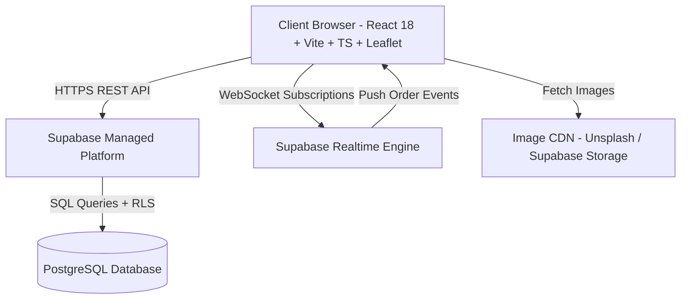
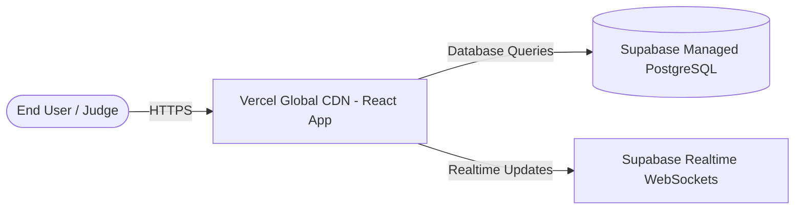

# 🏛️ High-Level Design (HLD) — FlashBites Food Delivery Engine

**Project**: FlashBites (Swiggy / Zomato Clone)  
**Architecture Version**: 2.0  
**Target Environment**: Hackathon Production Submission  

---

## 1. Requirement Specifications

### 1.1 Functional Requirements
1. **Multi-Role Authentication & Access Control**:
   - Distinct roles: `CUSTOMER`, `RESTAURANT`, `DELIVERY_PARTNER`, `ADMIN`.
   - Role-based authorization and view rendering.
2. **Restaurant & Menu Discovery**:
   - View nearby restaurants with details (cuisine, rating, image, ETA, address).
   - Filter menu items by Veg / Non-Veg and search by dish name.
3. **Transactional Cart & Order Placement**:
   - Add/remove items with quantity adjustment, real-time total calculation, and delivery address capture.
   - Transactional order creation (`orders` + `order_items`).
4. **Order Lifecycle State Machine**:
   - Strict 7-stage state transition enforcement:
     $$\text{Placed} \longrightarrow \text{Confirmed} \longrightarrow \text{Preparing} \longrightarrow \text{Ready for Pickup} \longrightarrow \text{Picked Up} \longrightarrow \text{Out for Delivery} \longrightarrow \text{Delivered}$$
   - Cancellation permitted **only** during `Placed` or `Confirmed` states.
5. **Real-time Kitchen & Driver Dispatch**:
   - Kitchen receives incoming customer orders instantly via WebSocket / Realtime subscription.
   - Nearest available delivery partner auto-assigned upon `Ready for Pickup`.
6. **Live GPS Map Tracking**:
   - Leaflet + OpenStreetMap canvas rendering live driver coordinates during `Out for Delivery`.
7. **Customer Toast Notifications**:
   - Automatic alert toasts on every order status shift.

### 1.2 Non-Functional Requirements
- **Performance**: $< 150\text{ms}$ REST response latency; 60fps Leaflet map rendering.
- **Scalability**: Managed Supabase PostgreSQL backend with connection pooling.
- **Reliability**: Fail-safe mock state fallback if remote DB connection is unavailable.
- **Security**: PostgreSQL Row Level Security (RLS) policies guarding customer and restaurant data access.

---

## 2. System Architecture Diagram

---

## 3. Module Description

| Module Name | Responsibilities |
|---|---|
| **Auth & Portal Dispatcher** | Handles login/register, role selection, and session storage. |
| **Customer Storefront** | Restaurant discovery, menu browsing, search/filters, cart checkout, ETA. |
| **Order Lifecycle Engine** | Validates state machine transitions, enforces cancellation guards, and manages order updates. |
| **Kitchen Console** | Real-time order queue management for restaurants (`Confirmed` → `Preparing` → `Ready for Pickup`). |
| **Driver Telemetry Engine** | Driver assignment, task pickup, and periodic GPS location broadcasting via Leaflet canvas. |
| **Notification Center** | Triggers visual toast notifications on order events. |

---

## 4. Technology Stack

- **Frontend**: React 18, Vite 5, TypeScript 5, Tailwind CSS 3, Lucide React Icons.
- **Maps & Location**: Leaflet 1.9 + React-Leaflet + OpenStreetMap tiles.
- **Backend Services**: Supabase (Managed PostgreSQL, Row Level Security, Realtime WebSockets).
- **State Management**: React Hooks + Context API + LocalStorage persistence fallback.

---

## 5. Deployment Architecture

