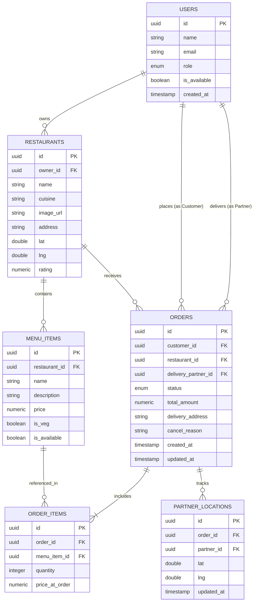
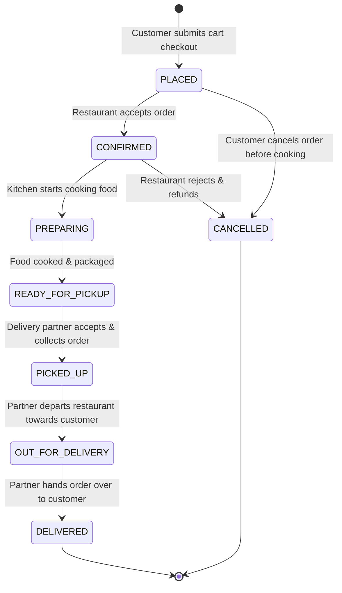

# 🔍 Low-Level Design (LLD) — FlashBites Food Delivery Engine

**Project**: FlashBites (Swiggy / Zomato Clone)  
**Document Version**: 2.0  

---

## 1. Database Schema & Entity-Relationship Diagram (Mermaid ER)

---

## 2. API Specifications Table

| Method | Endpoint | Description | Query / Body Parameters | Authorized Roles |
|---|---|---|---|---|
| `GET` | `/rest/v1/restaurants` | List active campus eateries & menus | `select=*,menu_items(*)` | Public / All |
| `POST` | `/rest/v1/orders` | Create new order with items | `{ customer_id, restaurant_id, total_amount, delivery_address, items: [...] }` | `CUSTOMER` |
| `PATCH` | `/rest/v1/orders?id=eq.{id}` | Update order status | `{ status: "CONFIRMED" \| "PREPARING" \| ... }` | `RESTAURANT`, `DELIVERY_PARTNER` |
| `POST` | `/rest/v1/orders/cancel` | Cancel eligible order | `{ order_id, cancel_reason }` | `CUSTOMER`, `RESTAURANT` |
| `POST` | `/rest/v1/partner_locations` | Update driver GPS position | `{ order_id, partner_id, lat, lng }` | `DELIVERY_PARTNER` |
| `GET` | `/rest/v1/partner_locations` | Fetch live partner coordinates | `order_id=eq.{id}&order=updated_at.desc&limit=1` | `CUSTOMER` |

---

## 3. Order Lifecycle State Machine

### State Machine Transition Rules Matrix

| Current State | Target State | Permitted Role | Validation Condition |
|---|---|---|---|
| `PLACED` | `CONFIRMED` | `RESTAURANT` | Kitchen must be open and active. |
| `PLACED` | `CANCELLED` | `CUSTOMER` | Allowed only before food prep starts. |
| `CONFIRMED` | `PREPARING` | `RESTAURANT` | Kitchen confirms cooking capacity. |
| `PREPARING` | `READY_FOR_PICKUP` | `RESTAURANT` | Triggers delivery partner auto-assignment. |
| `READY_FOR_PICKUP` | `PICKED_UP` | `DELIVERY_PARTNER` | Assigned driver must physically pick up order. |
| `PICKED_UP` | `OUT_FOR_DELIVERY` | `DELIVERY_PARTNER` | Live Leaflet GPS telemetry tracking active. |
| `OUT_FOR_DELIVERY` | `DELIVERED` | `DELIVERY_PARTNER` | Reaches customer dropoff coordinates. |

---

## 4. Error Handling Strategy

1. **Illegal State Machine Transition**:
   - Responds with `HTTP 400 Bad Request` and descriptive message: `"Cannot transition order status from PREPARING directly to DELIVERED."`
2. **Cancellation Guard Exception**:
   - Rejects cancellation requests once status is `PREPARING` or higher to prevent food waste.
3. **Empty Cart & Invalid Items**:
   - Frontend disables checkout button and alerts user if cart quantity is zero or restaurant items are out of stock (`is_available = false`).
4. **Unauthorized Role Actions**:
   - Supabase Row Level Security (RLS) policies prevent delivery partners from modifying menu prices or customers from accepting delivery assignments.
